# BlogBreeze

**Test User:**
- Username: user1
- Email: user1@example.com
- Password: password123

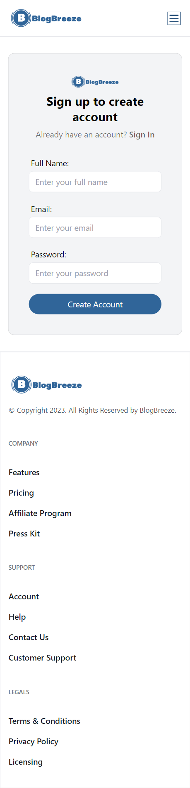
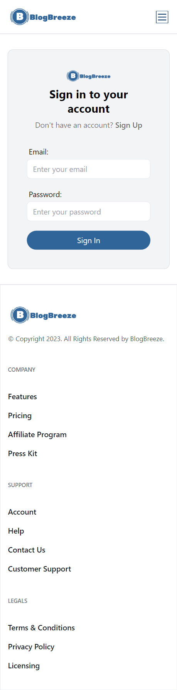
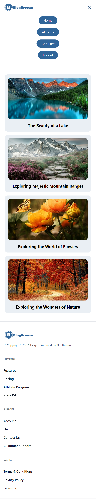
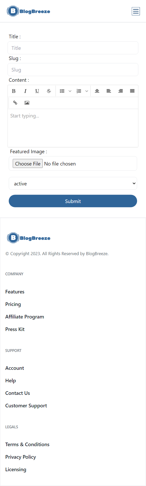
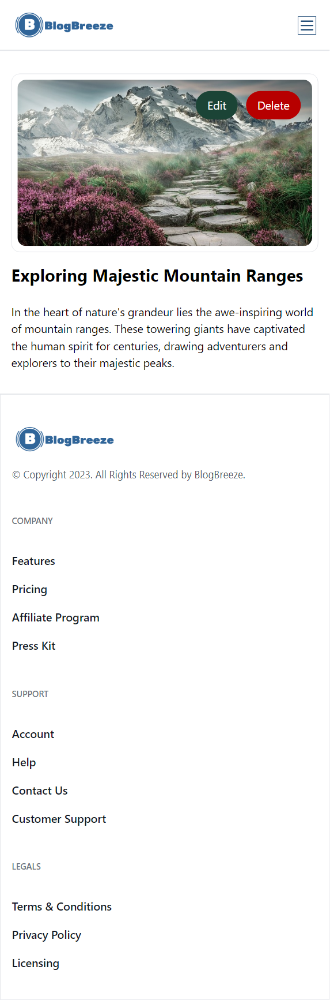
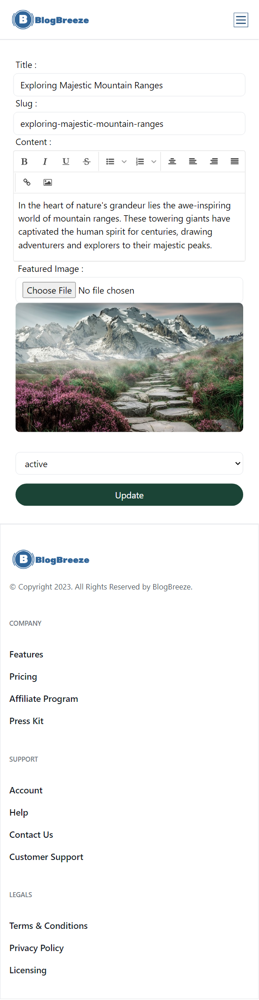
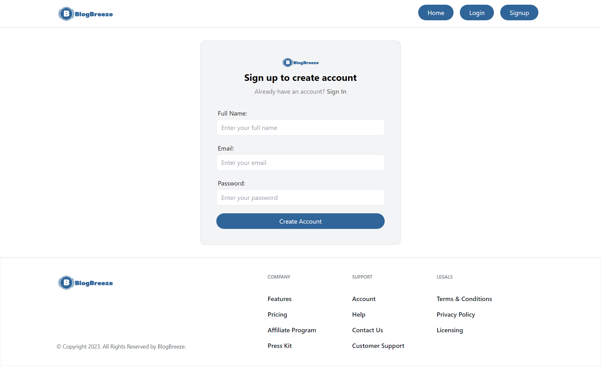
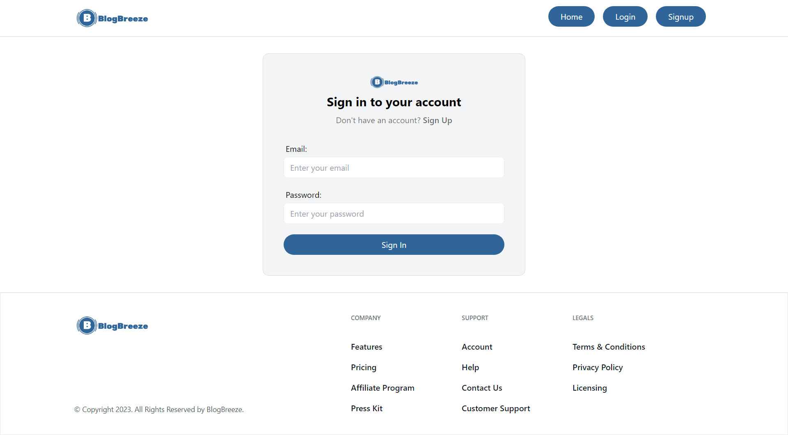
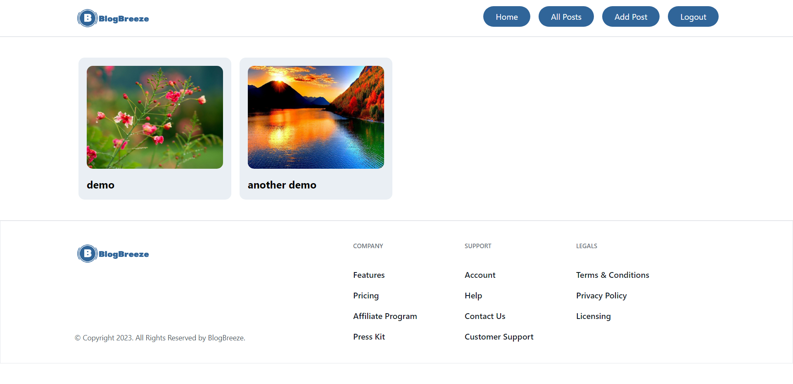
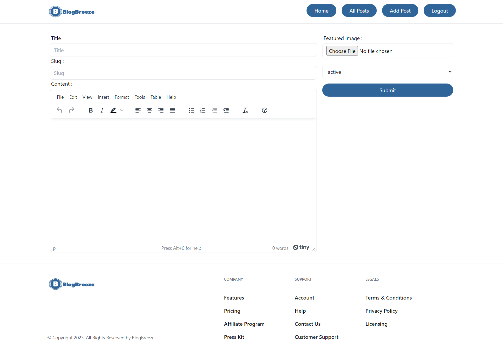
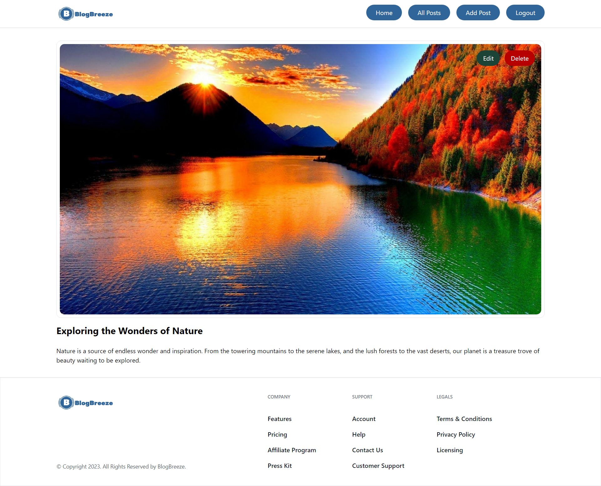
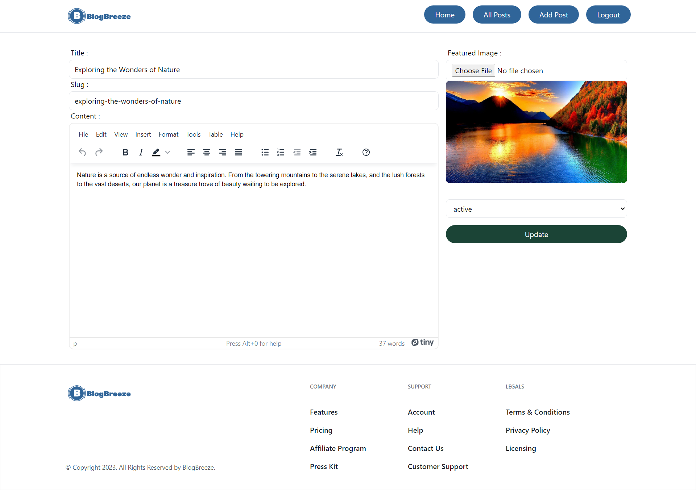

## Description
Designed and developed a full-featured blog application using React, enabling users to create, read, update, and delete blog posts. The application leverages Appwrite for backend services and incorporates various frontend technologies and libraries.

## Features
1. Implemented full responsive CRUD (Create, Read, Update, Delete) operations for blog posts.
2. Integrated user authentication and authorization using Appwrite for secure access.
3. Utilized React Router DOM for efficient navigation and routing within the application.
4. Improved form handling and validation using React Hook Form for a smoother user input process.
5. Enabled dynamic rendering of HTML content in blog posts using HTML React Parser.

## Tech Stack
Frontend: React, React Router DOM, React Redux
Styling: Tailwind CSS
Form Handling: React Hook Form
Backend Services: Appwrite
Data Parsing: HTML React Parser

## Getting Started
Clone this repository to your local machine using git clone https://github.com/akashsonkamble/blog-breeze.git Navigate to the project directory and install dependencies using npm install Start the development server using npm run dev Open your web browser and visit http://localhost:5173 to see the app in action.